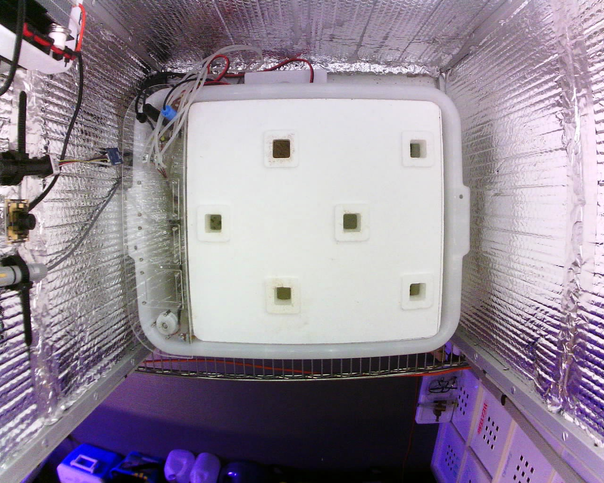
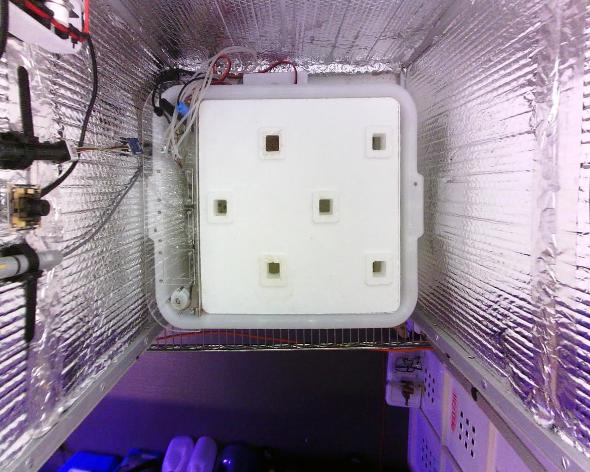
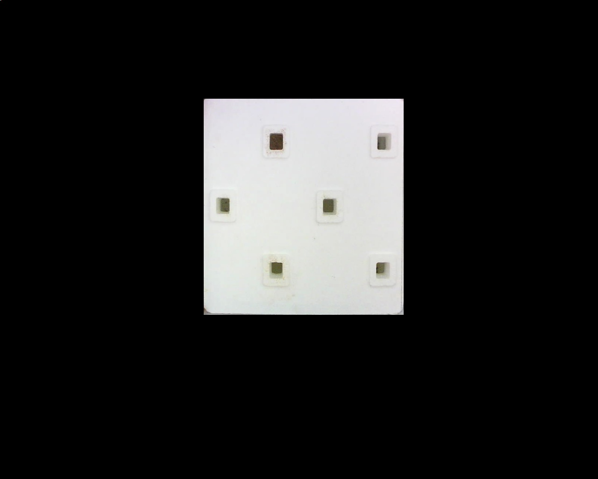
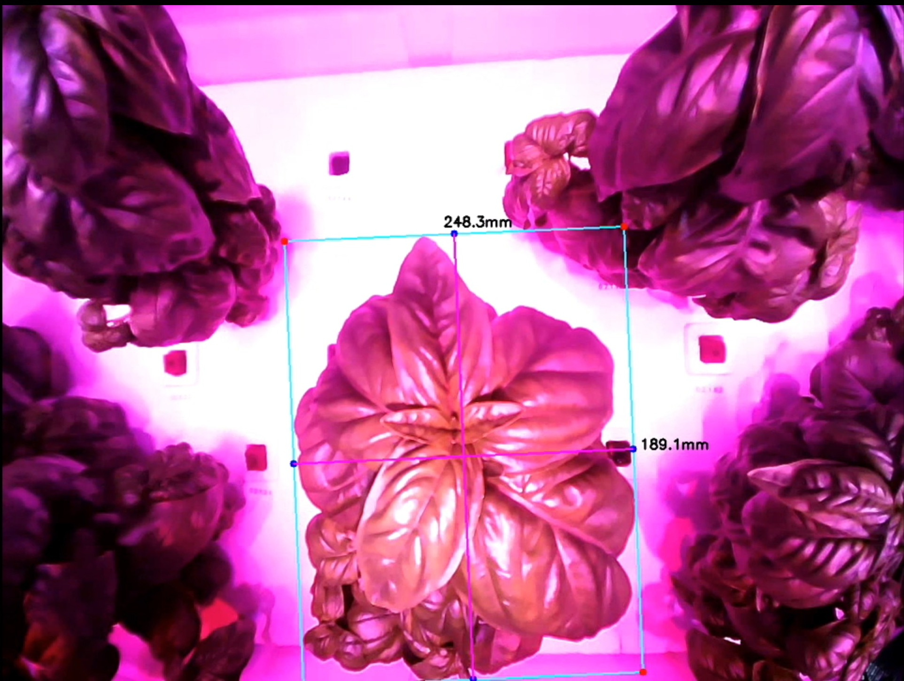
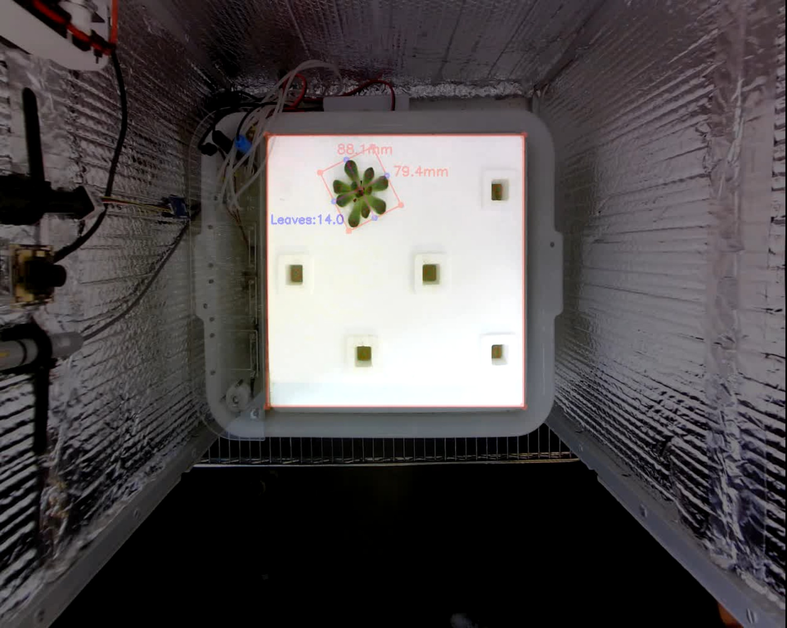

Initialize the cameras
======================

<span id="sec:InitializeCameras"></span>

One of the first things that need to be done in order to make the package work is to make sure the cameras are capturing images. In order to do that you should make sure that a camera is connected to the Raspberry Pi and available at:

-   /dev/video0 (top camera)
-   /dev/video1 (side camera)

Then you can launch the following command:

``` example
roslaunch openag_cv two_camera_img_acquisition.launch
```

Alternatively, you can use the one camera version of the launch file:

``` example
roslaunch openag_cv one_camera_img_acquisition.launch
```

The default values for the parameters in these launch files are:

-   framerate = 1
-   width = 1280
-   height = 1024
-   camera_model = elp5

    Note: This is required to load the calibration parameters located in the data/camera_calibration/ folder. For more information about how to create calibration files please take a look [here](http://wiki.ros.org/camera_calibration/Tutorials/MonocularCalibration).

Overriding the default parameter values
---------------------------------------

<span id="sec:OverrideParameters"></span> You can always customize the default parameters by including the following syntax in your command line:

``` example
roslaunch openag_cv img_acquisition.launch __param:=value
```

Camera image topics
-------------------

<span id="sec:CameraImageTopics"></span>

After successfully run this file you should be able to access to both image topics within your ros system:

-   /cameras/top/image_raw
-   /cameras/side/image_raw

You can check if the cameras are sending information to their respective topics with the following command:

``` example
rosrun image_view image_view image:= <source image topic>
```

Image rectification
===================

<span id="sec:ImageRectification"></span>

In order to get accurate measurements from the cameras, it is necessary to [rectify](https://en.wikipedia.org/wiki/Image_rectification) the image. You can do that by running the following launch file:





``` example
roslaunch openag_cv two_camera_img_rectification.launch
```

Note: This process can not be fulfilled if no calibration file has been passed during the camera initialization process. Please take a look at section <sec:CameraImageTopics>.

Isolate Mask Plant Tray
=======================

To focus the CV recognition methods where plants are grown and to not increase the complexity of the algorithms used masking the plant tray is needed.

Dimensions for the plant tray used in the PFCv2.0 [BOM](https://github.com/OpenAgInitiative/openag_pfc2/blob/master/BOM/BOM_MASTER.xlsx?raw=true) are coded into the *MaskPlantTray.py* file located in the *Utils* folder. You can obtain a "filtered" image running the following command:

``` example
rosrun openag_cv MaskPlantTray <source image topic>
```



This will always produce the following output topic:

``` example
<source image topic>/MaskPlantTray
```

Object Measurer (plant measuring method)
========================================

The object measurer code can be found in the *ObjectMeasurer.py* file and analyses an image looking for edges and contours. In case these contours are big enough we can measure them and calculate and display their bounding box.

The behavior of the object measurer can be changed dynamically given the following ROS parameters:

-   MinThreshold - Minimum threshold for the edge detector
-   MaxThreshold - Maximum threshold for the edge detector
-   MinAreaThreshold - Minimum area of the contours obtained
-   ReferenceMeasure - Reference used to calculate the other measures

For more information about how to deal with ROS parameters take a look [here](http://wiki.ros.org/Parameter%20Server).



This package will always produce the following output topic:

``` example
<source image topic>/ObjectMeasurer
```

Blob Detector (leaf detection method)
=====================================

The blob detector code can be found in the *BlobDetector.py* file and it analyses an image looking for shapes (i.e. blobs) with certain characteristics. After identifying these shapes, calculates their centers, counts them and aggregates them by plant socket (the plantation holes in the tray) using a k-means algorithm.

The behavior of the blob detector can be changed dynamically given the following ROS parameters:

-   FilterByColor - (True/False) Toggles the possibility to filter by color
-   BlobColor - Use lower values to extract darker blobs and higher values to extract lighter blobs.
-   FilterByArea - (True/False) Toggles the possibility to filter by area size
-   BlobMinArea - Minimum area threshold
-   BlobMaxArea - Maximum area threshold
-   FilterByCircularity - (True/False) Toggles the possibility to filter by circularity
-   BlobMinCircularity - Minimum circularity threshold
-   BlobMaxCircularity - Maximum circularity threshold
-   FilterByConvexity - (True/False) Toggles the possibility to filter by convexity
-   BlobMinConvexity - Minimum convexity threshold
-   BlobMaxConvexity - Maximum convexity threshold
-   FilterByInertia - (True/False) Toggles the possibility to filter by inertia
-   BlobMinInertia - Minimum inertia threshold
-   BlobMaxInertia - Maximum inertia threshold

For more information about how to tune these parameters you can take a look at the [official OpenCV documentation](http://docs.opencv.org/master/d0/d7a/classcv_1_1SimpleBlobDetector.html).



This package will always produce the following output topic:

``` example
<source image topic>/BlobDetector
```

Plant measuring and leaf detection
==================================

The aforementioned commands can be combined in order to create the desired interface where plant measurements are displayed together with leaf counts:


This representation can be achieve by running the following launch file:

``` example
roslaunch openag_cv two_camera_experiment.launch
```
